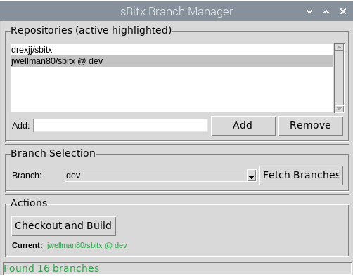

# sBitx Branch Manager

A GUI tool for managing different sBitx repository branches and building them on Raspberry Pi.



## Overview

This application allows testers to easily switch between different sBitx repositories (e.g., `drexjj/sbitx`, `jwellman80/sbitx`) and branches, then automatically checkout and build the selected version.

## Features

- **Repository Management**: Add and remove custom GitHub repositories
- **Branch Selection**: Fetch and select branches from any repository
- **Automatic Checkout**: Clone or switch to different repositories seamlessly
- **Build Integration**: Automatically run `./build sbitx` after checkout
- **User-Friendly GUI**: Simple tkinter-based interface
- **Persistent Configuration**: Saves your repository list between sessions

## Requirements

- Python 3.11+ (pre-installed on Raspberry Pi OS)
- Git
- Build dependencies for sBitx (make, gcc, etc.)
- tkinter (built into Python)

## Installation

### Option 1: Standalone Executable (Recommended for Testers)

1. Download the `sBitx-Branch-Manager` executable
   ```bash
   cd ~/
   wget https://github.com/jwellman80/sbitx-branch-manager/raw/refs/heads/main/dist/sBitx-Branch-Manager
   ```
2. Make it executable:
   ```bash
   chmod +x sBitx-Branch-Manager
   ```
3. Run it:
   ```bash
   ./sBitx-Branch-Manager
   ```

Or install system-wide:
```bash
sudo cp sBitx-Branch-Manager /usr/local/bin/
```

### Option 2: Run from Source

1. Clone or navigate to this repository:
   ```bash
   cd /home/pi/sbitx_branch_manager
   ```

2. Make main.py executable:
   ```bash
   chmod +x main.py
   ```

3. (Optional) Create a virtual environment:
   ```bash
   python3 -m venv venv
   source venv/bin/activate
   ```

### Building the Executable

See [BUILD.md](BUILD.md) for instructions on building the standalone executable.

### Automated Builds

Every push to the main branch triggers automatic builds:
- **x86_64 Linux** executable (for desktop/laptop testing)
- **ARM64 Linux** executable (for Raspberry Pi)

Download pre-built executables from the [Releases](../../releases) page or [Actions](../../actions) artifacts.

## Usage

### Running the Application

```bash
./sBitx-Branch-Manager
```

Or if you are building it from source:
```bash
python3 main.py
```

### Using the GUI

1. **Repository List**:
   - The app automatically detects and adds your current repository
   - Default repository (`drexjj/sbitx`) is always present and cannot be removed
   - Currently active repository is highlighted in green with branch name (e.g., `jwellman80/sbitx @ dev`)

2. **Add a Repository** (optional):
   - Enter a repository URL in the text field (e.g., `jwellman80/sbitx`)
   - Click "Add" or press Enter
   - Supported formats:
     - `owner/repo`
     - `github.com/owner/repo`
     - `https://github.com/owner/repo`
     - `git@github.com:owner/repo.git`

3. **Select Repository and Branch**:
   - Click on a repository in the list to select it
   - Click "Fetch Branches" to get available branches
   - Select a branch from the dropdown

4. **Checkout and Build**:
   - Click "Checkout and Build"
   - Wait for the operation to complete (may take several minutes)
   - Git and build output appears in the terminal
   - A success or failure message will be displayed
   - Repository list updates to show the new active repository

### Target Directory

The tool operates on `/home/pi/sbitx`:
- If the directory doesn't exist, it will clone the repository
- If it exists and is a git repo, it will change the remote and fetch
- If it exists but is not a git repo, an error will be shown

## Configuration

Configuration is stored in `config/repositories.json`:
- List of added repositories
- Last used repository and branch

## Project Structure

```
sbitx_branch_manager/
├── main.py              # Application entry point
├── models/
│   └── repository.py    # Repository data model
├── core/
│   ├── config_manager.py    # Configuration persistence
│   ├── git_manager.py       # Git operations
│   └── build_manager.py     # Build execution
├── gui/
│   ├── main_window.py   # Main application window
│   └── components.py    # Reusable GUI widgets
└── config/
    └── repositories.json    # Saved repositories
```

## Troubleshooting

### Build Fails
- Ensure all build dependencies are installed
- Check `/home/pi/sbitx` for error logs
- Try building manually: `cd /home/pi/sbitx && ./build sbitx`

### Cannot Fetch Branches
- Check your network connection
- Verify the repository URL is correct
- Ensure git is installed: `git --version`

### Directory Not a Git Repo Error
- Backup the existing `/home/pi/sbitx` directory
- Remove it: `rm -rf /home/pi/sbitx`
- Try again with the Branch Manager

## License

This tool is provided as-is for sBitx development and testing purposes.

## Author

Created for the sBitx project testing workflow.
